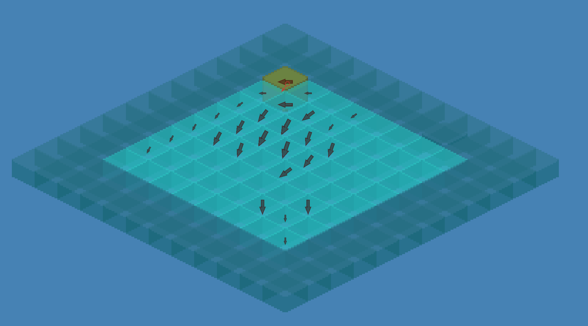
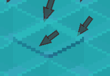
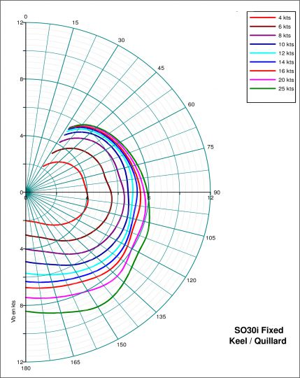

## Boat regata POC

This repository implements a smart contract (a game) for Starknet in cairo language (cairo 0.2.2).

The goal of this repository is to test the `dojoengine` framework combined with a math library (`cubit` for computations in the smart contract) and `react`, `pixi` on front side.  

This boat game is a prototype of a boat regatta. The boat moves forward depending on the wind and the direction of the boat (the sail is considered always at optimum !). 


### World

#### Map

This smart contract defines a map of 8 * 8 cells , each cell have specific wind information (wind speed, direction (as a vector)).
Each cell represents a square of 100 by 100, For example, the tile (0; 0) corresponds to coordinates (0; 0) to (100; 100).


#### Wind

Each cell has a specific wind information (speed and direction). The wind is displayed as an arrow oriented relative to the direction and scaled depending on the wind speed.



#### Boat

The boat next position is computed with a boat polar table and takes only the wind and the boat direction into account.

The smart contract computes very precisely the position of the boat (using Fixed type of the cubit library).

The graphical representation approximates the position displayed. For example, coordinates (91.352487; 93.65454) will be rounded to (91; 93).


#### Polar

The polar of a boat is a table that gives the effective speed of a boat depending on the wind incidence with the boat direction. For exemple, for a wind speed of 8 knot and 52 degrees the boat will move at a speed of 6.77 knot



### User actions
For the moment this prototype allows the user to
- create a map. 
- spawn a boat at location (90, 90).
- change the boat position with a "step" button.
- change the boat direction with a "turn" button. (45 degrees clock-wise) 


## How to setup your env and launch the game (localy)

Dive into this straightforward example to understand how to meld React with Dojo.

This integration taps into the powerful libraries designed by [Lattice](https://lattice.xyz/):

- [recs](https://github.com/latticexyz/mud/tree/main/packages/recs)

### Initial Setup

**Prerequisites:** First and foremost, ensure that Dojo is installed on your system. If it isn't, you can easily get it set up with:

```console
curl -L https://install.dojoengine.org | bash
```

Followed by:

```console
dojoup    
```

For an in-depth setup guide, consult the [Dojo book](https://book.dojoengine.org/getting-started/quick-start.html).

### Launch the Example in Under 30 Seconds

After cloning the project, execute the following:

0. **init submodule**

TO REMOVE
```
git submodule update --init --recursive
```

1. **Terminal 1 - Katana**:

```console
cd contracts && katana --disable-fee
```

2. **Terminal 2 - Contracts**:

```console
cd contracts && sozo build && sozo migrate

// Basic Auth - This will allow burner Accounts to interact with the contracts
sh ./contracts/scripts/default_auth.sh
```

3. **Terminal 3 - Client**:

```console
cd client && yarn && yarn dev
```

4. **Terminal 4 - Torii**:

Uncomment the 'world_address' parameter in `contracts/Scarb.toml` then:

```console
cd contracts && torii --world {world_address}
```

Upon completion, launch your browser and navigate to http://localhost:5173/. You'll be greeted by the running example!

